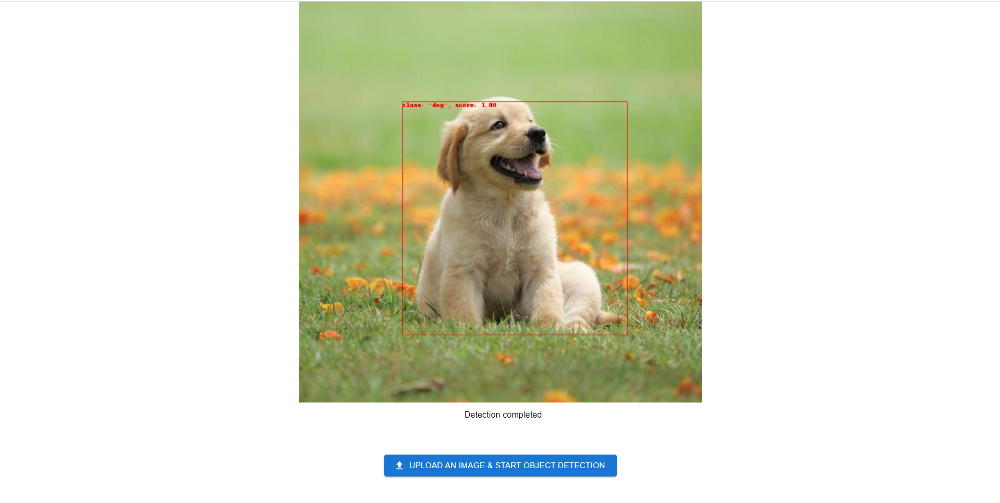

# Object Detector
This is web based image object detector that consists of React.js, FastAPI and TensorFlow.

## Screenshot

UI:


## Getting Started
To get started with this project, follow these steps:

### Prerequisites
Before you can run the front-end and back-end servers, you need to have the following software installed on your machine:

- Node.js
- npm
- Python 3
- pip
- TensorFlow

### Installing
To install the project dependencies, run the following command in `ObjectDetector/front-end/object-detector/`:

```
npm install
```

This will install all the necessary dependencies for the front-end server.

To install the back-end dependencies, run the following command in `ObjectDetector/back-end/`:

```
pip install -r requirements.txt
```

This will install all the necessary dependencies for the back-end server.

### Configuration

#### Configuration of Front-end
Before you can start the servers, you need to set the API URL and port in the `.env` file. Follow these steps to set up the API URL and port:

1. Open the `.env` file in the `ObjectDetector/front-end/object-detector/` directory.

2. Update the `REACT_APP_API_URL` and `REACT_APP_API_PORT` fields with the correct API URL and port. For example:

```
REACT_APP_API_URL=127.0.0.1
REACT_APP_API_PORT=8000
```

Replace `127.0.0.1` with the IP address or domain name of your server, and `8000` with the port number that the back-end server will be running on.

#### Configuration of Back-end
Before you can start the back-end server, you need to edit the URL of your model in `ObjectDetector.py`. Follow these steps to edit the URL of your model (you can download a model from: https://tfhub.dev/tensorflow/faster_rcnn/resnet50_v1_640x640/1):

1. Put your model into the `model` folder

2. Open the `ObjectDetector.py` file in the `ObjectDetector/back-end/` directory.

3. Update the `model_url` field with the correct model URL. For example:

```
model_url = './model/faster_rcnn_resnet50_v1_640x640_1'
```

4. Save the ObjectDetector.py file.

### Starting the Servers

To start the front-end server, run the following command in `ObjectDetector/front-end/object-detector/` of the project:

```
npm start
```

This will start the front-end server on port 3000.

To start the back-end server, run the following command in `ObjectDetector/back-end/`:

```
uvicorn main:app --host 0.0.0.0 --reload
```

This will start the back-end server on port 8000.

### Accessing the Application
Once the servers are running, you can access the application by opening a web browser and navigating to http://localhost:3000. This will display the front-end of the application.

The back-end API can be accessed by sending HTTP requests to http://localhost:8000. The API documentation can be found in the http://localhost:8000/docs.

## Built With
- React.js
- FastAPI
- TensorFlow

## Authors
- Oscar Ng

## License
This project is licensed under the MIT License - see the LICENSE file for details.
